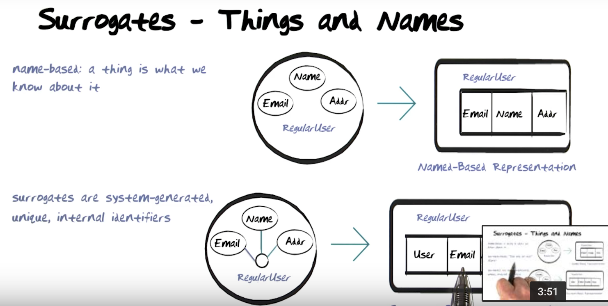
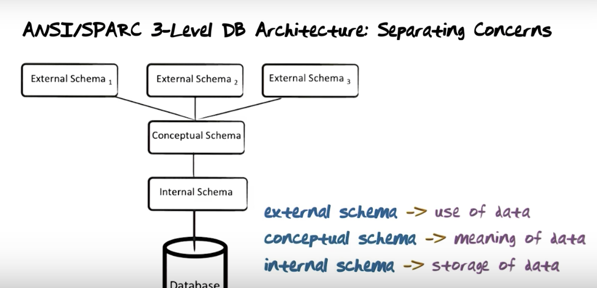

## Database Systems Concepts & Design
## Lesson2. Fundamentals of Databases

1.  왜 모델을 사용하는가?
- 모델은 실제 세계의 일부분을 실험하고 조정하는데 유용하다
- 모델을 사용하는 비용은 실제 세계에서 실험하는 것보다 상당히 낮다
- ex) 지도, 쓰나미 경고 시스템, 교통 시뮬레이션,

2. A map is a model of reality
- 모델은 커뮤니케이션을 의미한다
- 모델의 유저는 공통적인 특정 시직을 가지고 있어야 한다.
- 모델은 특정 선택된 측면들을 강조 한다.
- 특정 언어로 이루어져있다.
- 잘못 된 경우도 있다.
- 실제에 존재하지 않는 특징들을 가질 수도 있다.

3. To use or not to use
- To use
    - 데이터에 강한 앱들
    - 데이터를 지속적으로 통제
    - 데이터를 다루는 것에 집중시키다
    - 중복성(redundancy) 을 통제하는 것
    - 데이터의 일관성과 무결성을 통제
    - 여러 유저들이 사용하는 것을 지원
    - 데이터를 공유하는 것
    - 데이터를 문서화 하는 것
    - 데이터의 독립성
    - 데이터 접근에 대한 보안성
    - 데이터 백업
- Not to use
    - 초기 투자 비용이 너무 높은 경우
    - 병행성으로 데이터를 조작하거나 복원 비용이 너무 높은 데이터 -> 보편성이 없는 경-
    - 데이터 혹은 앱이 너무 간단한 구조로 이루어져있는 경우
    - 다중 사용자의 접근을 필요로 하지 않는 경우 실시간 요구 사항을 충족 시킬 수 없다.

4. Data Modeling
- 모델은 실제 구조들의 대한 인식을 나타낸다.
- 데이터 모델링 과정은 실제 데이터 구조 인식을 고치거나 나타낸다.
- 리가 선택한 측면과 추상화 시킨 것들을 모델링하는 과정이다.

5. Process Modeling
- 프로그래밍 코드를 사용하여 현실과정을 사용한다.
- DML

6. examples of data models
- 데이터 구조
- 무결성 제약 조건
- 운영
- 객제 관계 모델
- relational model
- hierarchical model -> 오래전부터 있었고 오늘날 xml

7. relational model
- 테이블로 표현한다.
- 스키마 : 시간이 지남에 따라 안정적인 데이터 측면을 말한다. / 데이터의 구조를 일반적으로 나타낸다.
- 제약 조건
    - 기본키는 반드시 유니크해야 한다.
    - 기본키는 null 을 허용하지 않는다.
- 운영

```SQL
select Email, BirthDate
from RegularUser
where Hometown = 'Atlanta' and Salary > 12,000;
```

8.  Integrity and consistency (무결성 제약 조건)
- 데이터베이스에 저장된 데이터의 무결성을 보장하고, 데이터베이스 상태를 일관되게 유지

9.  Null values
10.  Surrogates Things and Names

- Named-Based 표기 : 우리가 알고있는 것에 대한 표기
- surrogates : 시스템에서 생성된 고유한 내부 식별자 ex) user_id
11. ANSI-SPARC - ANSI-SPARC 3 level db 구조
- 데이터베이스는 스키마와 데이터에 따라 나누어진다
- 스키마는 의도 타입을 나타낸다
- 데이터는 확장 데이터들을 의미한다

- external : 데이터에 사용됨
- conceptual : 데이터 의미
- internal 스키마 : 데이터 저장
