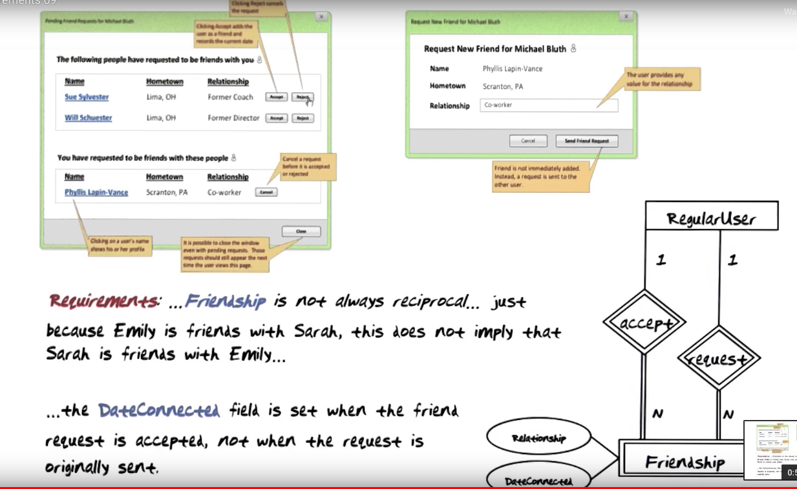

## Database Systems Concepts & Design
### Lesson5.

----

1. 인스타 팔로우 개념
내가 친구를 걸수도 있으나 이게 반대로 무조건 되는건 아니다.

2. reading diagram
줄글로 설명된 것들은 이야기하는 건 좋으나. 이해하는데는 오랜 시간이 걸릴 수 있음

3. 가이드라인
데이터 타입에 대한 정리 된 문서

4. constraints
- 데이터연결은 연결이 될때까지 Null 신호를 보낸다.
- 자기자신과는 친구가 될 수 없다.(팔로우이야기하는듯)
- 친구 관계에 대해서만 오로지 댓글을 달 수 있다.
- 데이터 제한사항
- 이러한 제한 사항을 EER 다이어그램으로 표현할 수 있다.

5. Decomposition (분해) 기준
- Look up vs 삽입,삭제, 업데이트
- 몇개의 스키마 제한사항들을 가지고 있는가? -> 데이터베이스가 많은 경우, 데이터베이스의 현재 실행을 서포터하기위해 로그나 이런걸 요청하는게 어렵다. -> 이 경우 작은 단위로 작업을 쪼개서 실행
- 일관된 제약 조건인가?
- 빈번한 제약조건인가? -> 인덱스로 작업속도를 빠르게 함
- 일관성이 필수적인가? ex) 입출금
- 선작업이 필요한가? (mother tasks)

6. wep-apps / Traditional-apps
7. mother task -> 반드시 먼저 실행되어야 한다.
