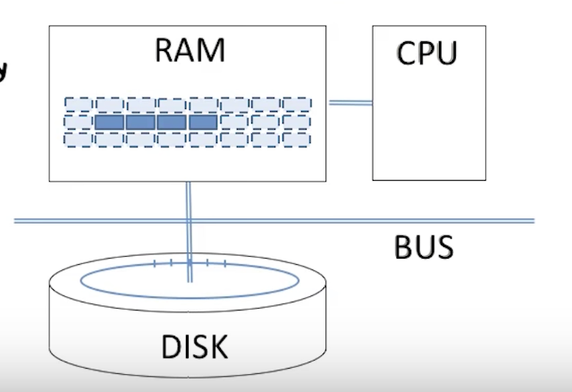
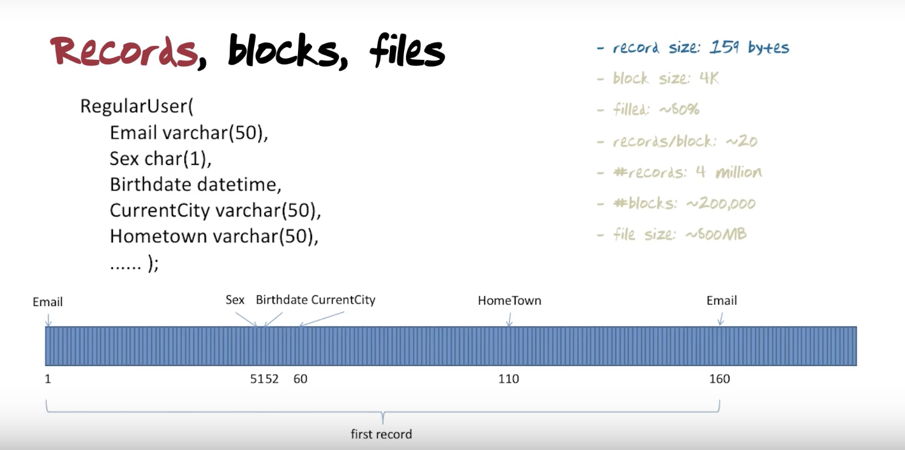

## Database Systems Concepts & Design
### Lesson12. Efficiency

-----

1. Computer architecture

-  메인메모리/ RAM : 휘발성 메모리, 굉장히 빠름, 작고 ,비쌈
- Secondary memory - DISK : 비휘발성 메모리, 느림, 용량이 크고 가격이 저렴
- CUP : 메인메모리에 저장된 애플리케이션을 실행
- BUS : 버스는 메인메모리에서 데이터를 옮기거나 쓰고 그걸 다시 되돌려 놓는 일을 한다.
- CPU로 실행되는 응용 프로그램은 주 메모리의 데이터만 쿼리 혹은 업데이트만 할 수 있다.
- 데이터가 업데이트가 된 이후에는 반드시 Secondary 메모리에 저장되어야 한다.
- 실제 데이터베이스의 아주 작은 부분만 메인 메모리에 있다.

2. 왜 이걸 신경써야 하는가?
- 시간
    - 메인 메모리 접근 가능 시간 : 30ns
    - 디스크 접근 가느 시간 : 10ns
- 비용 계산
    - 읽고쓰기 계산만 체크
    - CPU 비용은 신경 쓰지 않음

3. 디스크
4. 레코드

5. 블록

- DBMS가 데이터를 저장하는 가장 작은 단위 데이터 블록이라 한다.

6. 파일
- records/block : ~20 -> 20번 나눌 수 있음
- 200,000 블럭이 존재
- 파일 사이즈는 800MB

7. 가정
- LRU 알고리즘 : 오래전에 사용된 것은 디스크에 저장하고 메모리에 가장 최근 사용된 데이터를 저장 -> 디스크 I/O 줄이고 데이터베이스 시스템 성능은 증가하게 관리
    - 병합 조인
    - 외래키로 조인
- 많은 데이터를 변형한다고 가정 할때, 남아있는 메모리 공간을 다 사용하면 우리는 메인메모리 디스크로부터 새로운 데이터 공간을 가져와야 한다.

8. Heap - Unsorted
- 정리되지 않는 블럭들에서 원하는 정보를 찾는 과정을 의미하는 것 같음
- 경우에 따라서 처음 블럭에서 바로 찾을수도 있으나, 아닌 경우도 있음

9. 정렬된 파일
- 결과적으로 정리되지 않은 파일과 별바다른게 없다.
- 중간부터 찾아보게 하거나, 가운데를 기점으로 왼쪽 오른쪽을 찾아보는 것도 좋음

10. Primary index

- 각 블럭들의 첫번째 PRIMARY KEY를 복사하여 그것들만 모아놓은 블럭을 만듦
- k1 : 블럭의 primary key
- 그 옆 블럭 : values

11. Secondary index
- point quereis only
- Primary key 를 제외한 나머지 모든 인덱스를 보조 인덱스라고 한다.

12. Multi-level index
13. Multi-level b+tree
- 가장 많이 사용하는 기법
- [참고](http://runtoyourdream.tistory.com/137)

14. Static Hashing
- Hash key 스페이스는 주소 값보다 좀더 커야 한다.
- 좋은 점
    - 주소 공간에 값을 균일하게 분배시킨다.
    - 가능한 버킷들을 채운다.
    - 충돌을 피할 수 있다.
- 너무 깊게 만들면 안되다. 
- [참고](http://middleware.tistory.com/entry/%EC%9D%B8%EB%8D%B1%EC%8A%A4Index%EC%99%80-%ED%95%B4%EC%8B%B1Hashing)
