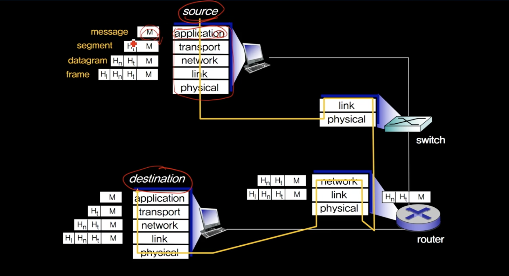

## 컴퓨터 네트워킹

----

## Protocol Stack

1. 통신 프로토콜
- []
- 영역들을 레이어, 계층이라고 불림
- Airline Travel과 비슷
  - 티켓 구매 -> 수화물 -> 게이트에 탐승 -> 이륙 -> 착륙 -> 내림 -> 수화물 내림 -> 마일리지 관련 일 처리
  - 출발공항과 도착공항이 대응됨

2. 인터넷 프로토콜
- application(응용 계층) : 우리가 사용하는 프로그램 ex)FTP, SMTP, HTTP
- transport(전송 계층) : 데이터들을 전달 ex) TCP, UDP
- network(네트워크) : source 부터 목적지까지 길을 찾아주는 기능 ex) IP, routing 프로토콜
- link : 하나의 호스트에서 다른 호스트를 연결해주는 기능 ex) wifi
- physical(물리 계층) : 유선 계층에서 각 케이블에 따라 비트정보를 어떻게 처리할 것인가? 아니면 무선인 경우 어떻게 응답을 받을 것인가에 대한 것

3. ISO/OSI (OpenSystemInterconnection) 계층
- application - representation - session - transport - network - link - physical (7계층)
- preservation, session 계층은 인터넷 프로토콜의 경우 application계층에 포함
- 인터넷이 먼저 만들어졌기 때문에 표준 프로토콜 스택과 좀 다름
- presentation : 암호화, 데이터 암축(인코딩/디코팅)
- session : 연결을 관리해주는 것

4. 왜 레이어를 만들었을까?
- 모듈화 되어있기 때문에 각 기술자들은 개별 모듈만을 유지보수하고 관리하면 된다.
- 하나의 서비스를 구축할때 다른 계층을 알면 효율성을 높일 수 있으나 그렇지 않기 때문에 효율서이 좀 더 떨어질 수 있다.
ex)출발지-목적지 최단길이만 보는 것이 아니라 길의 혼잡도를 파아갛여 좀 더 빠르게 목적지에 도착 할 수 있게 만든 네이게이션 -> 물리계층 정보를 상위 계층에서 사용할 수 있으면 효율성을 높일 수 있다.
- 계층간의 엄격한 구분이 없는 프로토콜도 사용하고 있다.

5. Encapsulation

- Encapsulation : 어떤 메시지의 헤더가 차레차례 붙어지는 작업을 캡슐화라고 한다.
- application (message) -> transport (segment-message)
- transport header 정보를 segment
- datagram 목적지까지의 정보를 가지고 있음 -> IP 데이터그램
- switch : 링크 데이터의 헤더에 담긴 정보만 이용해서 패킷을 보내늑 서
- router : 네트워크 레이어 정보까지 이용하는 것은 라우터
- 애플리케이션 프로그램들은 하위단에서 어떤 일이 발생해서 목적지까지 왔는지에 대한 정보가 없다.
단지 메시지를 주고 받은 것에 대해서만 알게 됨
